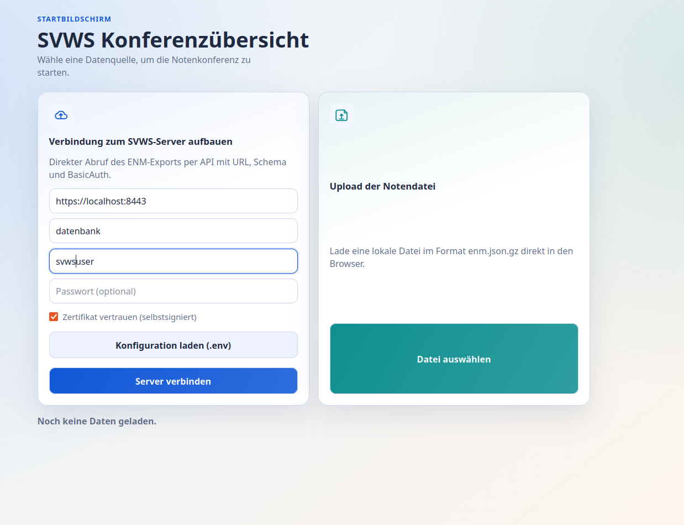
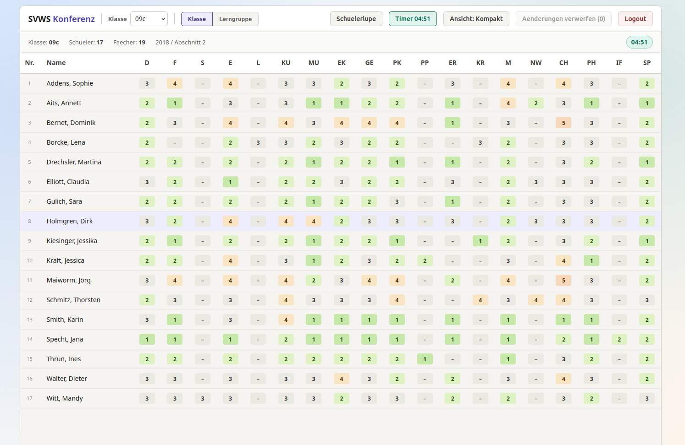
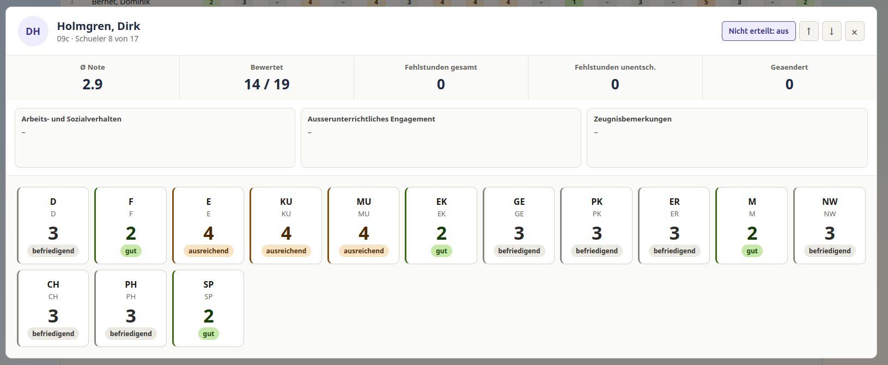
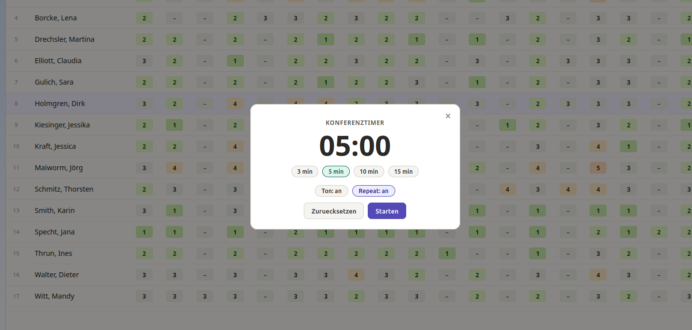

  

# Oberfläche im Überblick

[Startseite](../index.md) | [Inhaltsverzeichnis](00-inhaltsverzeichnis.md) | [Einleitung](01-einleitung.md) | [Schnellstart](02-schnellstart.md) | [Voraussetzungen](03-voraussetzungen.md)

Dieses Kapitel beschreibt die wichtigsten Bereiche der Benutzeroberfläche und ihre Funktion.

**Wichtige Bereiche**

- **Login und Datenupload**: Wenn Sie die Anwendung online mit einem SVWS-Server nutzen, geben Sie Benutzername und Passwort in der Server-Kachel ein und klicken auf „Abrufen“. Alternativ laden Sie eine Exportdatei (`enm.json.gz`) per Drag & Drop oder über die Schaltfläche „Datei auswählen“ hoch. Nach dem Upload sehen Sie eine kurze Bestätigung und den Namen der geladenen Datei. (Zum Vergleich: Screenshot 1 zeigt Login & Upload.)

- **Klassenübersichtstabelle**: Die zentrale Tabellenansicht zeigt pro Klasse die aufbereiteten Datensätze — Schülernamen, Leistungsnoten, Status und ggf. Kommentarspalten. Nutzen Sie die Kopfzeilen zum Sortieren, die Suchleiste für schnelles Filtern und die Auswahl links, um zwischen Klassen zu wechseln. Klicken Sie eine Zeile an, um Details zu öffnen. (Screenshot 2 stellt die Tabellenübersicht dar.)

- **Schülerlupe (Schnellansicht)**: Per Lupe-Icon oder Doppelklick auf einen Schüler öffnen Sie eine kompakte Schnellansicht: Notenübersicht, Fehlstunden und Bemerkungen für die Konferenz. Diese Ansicht ist ideal, um vor einer Entscheidung schnell die relevanten Informationen zu prüfen, ohne das Hauptfenster zu verlassen. (Screenshot 3 zeigt die Schülerlupe.)

- **Timer / Konferenzzeitmesser**: Oben rechts finden Sie einen Timer, der die verbleibende oder verstrichene Zeit der Besprechung anzeigt. Starten, pausieren oder nullen Sie den Timer über die danebenliegenden Tasten. Der Timer dient als Orientierung für die Zeitplanung einzelner Tagesordnungspunkte. (Screenshot 4 zeigt den Timer.)

Weiterführend: Detaillierte Bedienanleitungen zu einzelnen Bereichen folgen in den Kapiteln "Daten laden" und "Konferenzübersicht nutzen".
