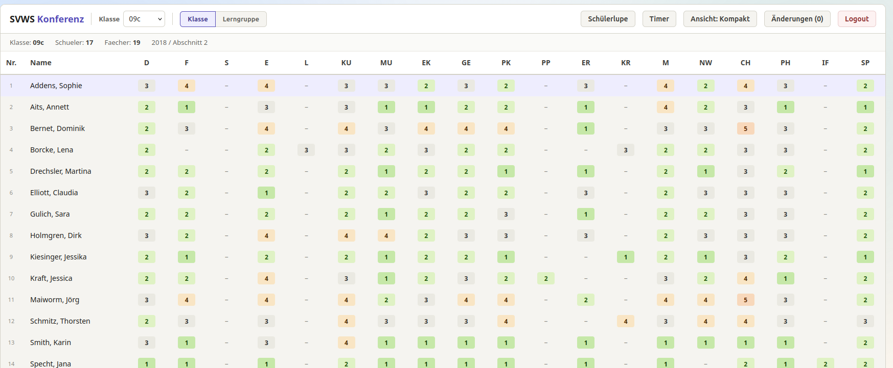

  

# Konferenzübersicht nutzen

Dieses Kapitel erklärt die wichtigsten Funktionen der Konferenzübersicht für neue Anwender und wie Sie schnell zu Ergebnissen kommen.

## Klassenübersicht nutzen

- Wählen Sie links eine Klasse oder Lerngruppe aus der Liste. Die Tabelle in der Mitte zeigt alle Schülerinnen und Schüler der gewählten Klasse mit den relevanten Spalten (Name, Gesamtbewertung, Status, Kommentare).

## Noten ändern

- Einzelne Noten können direkt in der Tabellenansicht editiert werden (Klick in die Zelle). Nach Änderung bestätigen Sie die Eingabe per Enter oder durch Klicken außerhalb der Zelle.
- Änderungen werden lokal im Browser gespeichert; nutzen Sie die Export-Funktion, um Ihre Änderungen extern zu sichern.

## Konferenztimer nutzen

- Oben rechts befindet sich der Timer: Start, Pause und Reset. Nutzen Sie den Timer zur Zeitplanung einzelner Tagesordnungspunkte.
- Der Timer zeigt verstrichene und verbleibende Zeit an (je nach gewählter Anzeige).
- Bei Timer Repeat: an wird er Timer bei Wechsel auf einen anderen Schülerdatensatz automatisch neu gestartet.

## Ansicht (kompakt / groß)

- Wechseln Sie zwischen kompakter und großer Tabellenansicht über die Ansichtsschaltfläche oberhalb der Tabelle. Die kompakte Ansicht zeigt mehr Zeilen, die große Ansicht mehr Detailspalten.

## Änderungen exportieren

- Nach der Bearbeitung klicken Sie auf **Änderungen**, um eine druckerfreundliche Ansicht oder PDF-Datei zu erzeugen. Diese Datei können Sie zur Archivierung oder für die Weitergabe nutzen.
- Die Exportfunktion nutzt den Weg, der bei Zugang zur App gewählt wurde, also entweder synchronisation über API oder erstellung einer Notendatei.

## Logout

- Nutzen Sie die Logout-Schaltfläche im Kopfbereich, um Ihre Session zu beenden. Bei einer Logout-Aktion werden lokale Bearbeitungen nicht automatisch an einen Server übertragen — denken Sie an einen Export, falls Sie Änderungen sichern wollen.

Weiterführend: Siehe Kapitel 4 für UI-Elemente und Kapitel 5 für das Laden von Daten.
